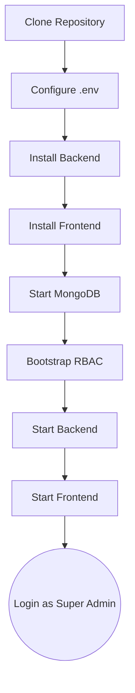
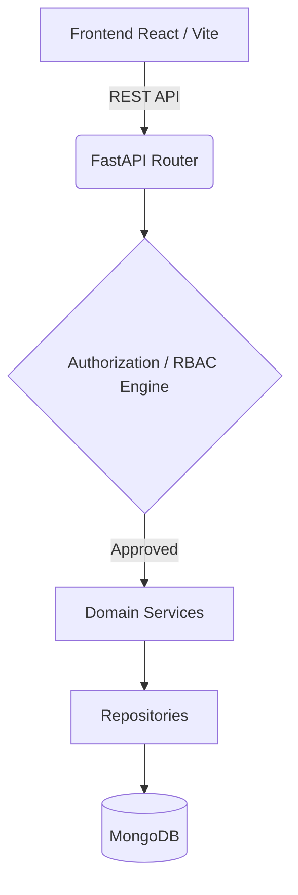
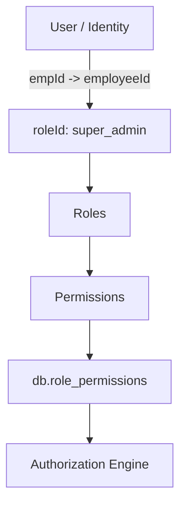
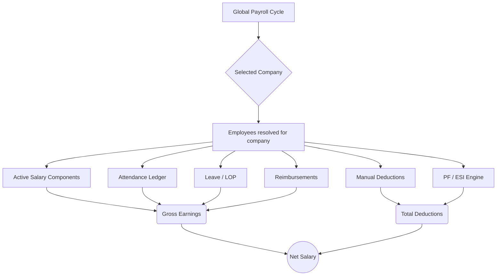

# 🏢 ESS — Enterprise Employee Self Service

> **A modular HRMS, Attendance & Payroll platform for enterprise workforce management.**

[](https://fastapi.tiangolo.com/)
[](https://react.dev/)
[](https://www.mongodb.com/)
[](https://python.org)
[](https://nodejs.org)

The ESS system is a comprehensive backend and frontend Enterprise HRMS application. It includes robust authentication, Role-Based Access Control (RBAC), organization structures, employee lifecycle management, policy configuration (shifts, attendance, leaves), attendance processing, leave ledgers, and a complete payroll engine.

This repository serves as the definitive source of truth for the system's architecture and operation.

---

## 📚 Documentation

- [🚀 Quick Start](#-quick-start)
- [📦 Product Overview](#-product-overview)
- [✨ What ESS Does](#-what-ess-does)
- [🗺️ Developer Journey](#-developer-journey-from-zero-to-first-payroll)
- [🏗️ Architecture](#-architecture)
- [🔐 Authentication & RBAC](#-authentication--rbac)
- [🏢 Initial System Setup](#-initial-system-setup)
- [👥 Employee Lifecycle](#-employee-lifecycle)
- [💰 Salary Architecture](#-salary-architecture)
- [🕒 Attendance Architecture](#-attendance-architecture)
- [📅 Leave Architecture](#-leave-architecture)
- [💵 Payroll Engine](#-payroll-engine)
- [📊 Payroll Control](#-payroll-control)
- [⏱️ Scheduler Architecture](#️-scheduler-architecture)
- [🧰 Repository Structure & Tools](#-repository-structure--tools)
- [🔧 Troubleshooting](#-troubleshooting)

---

## 🚀 Quick Start

The shortest reliable setup path to get the application running from a fresh clone:



1. **Install Dependencies**
   ```bash
   # Backend
   cd backend
   python -m venv venv
   source venv/bin/activate  # On Windows: .\venv\Scripts\Activate.ps1
   pip install -r requirements.txt
   
   # Frontend
   cd ../
   npm install
   ```
2. **Configure Database & Environment**
   Create `backend/.env`:
   ```env
   MONGODB_URI="mongodb://localhost:27017"
   MONGODB_DB_NAME="ess_production"
   JWT_SECRET="your-jwt-secret"
   ```
3. **Bootstrap RBAC**
   ```bash
   cd backend
   python scripts/seed_bootstrap.py
   ```
4. **Start Application**
   ```bash
   # Terminal 1 (Backend)
   cd backend
   python -m uvicorn app.main:app --reload
   
   # Terminal 2 (Frontend)
   npm run dev
   ```
5. **Login**
   Go to `http://localhost:5173` and login with Employee Code: `0001` and Password: `Admin@123`.

---

## 📦 Product Overview

```text
┌──────────────────────────────────────────────────────────────┐
│                         ESS PLATFORM                         │
├──────────────────────────────────────────────────────────────┤
│                                                              │
│  👥 Employee        🏢 Organization       🕒 Attendance      │
│       │                    │                    │            │
│       └────────────────────┼────────────────────┘            │
│                            ↓                                 │
│                    📋 Policy Engine                          │
│                            ↓                                 │
│                     💰 Payroll Engine                        │
│                            ↓                                 │
│                  📊 Payroll Control                          │
│                            ↓                                 │
│                     💳 Net Salary                            │
│                                                              │
└──────────────────────────────────────────────────────────────┘
```

---

## ✨ What ESS Does

| Domain | Capability |
|--------|------------|
| 🔐 **Authentication** | Login, JWT identity resolution, secure API access |
| 🛡️ **RBAC** | Deep authorization via canonical roles, permissions, and scopes (Global, Company, Self) |
| 🏢 **Organization** | Hierarchical mapping of Companies, Branches, and Departments |
| 👥 **Employee** | Complete employee lifecycle, employment history tracking, and active status |
| 🕒 **Attendance** | ESSL device log sync, processing engine, policy evaluation, and financial ledger generation |
| 📅 **Leave** | Leave types, policy configuration, approval workflows, and leave ledgers (Credited, Availed, Balance) |
| 🔄 **Scheduler** | Automated background processing (APScheduler) for attendance logic and syncs |
| 💰 **Payroll** | Salary structures, generic components (Basic, DA), and statutory engines (PF, ESI) |
| 📊 **Payroll Control** | Dedicated review flow: Global cycle → Company → Ledgers → Adjustments → Net Salary Calculation |

---

## 🗺️ Developer Journey: From Zero to First Payroll

Follow this exact flow to validate a complete, end-to-end installation:

1. [**Install ESS**](#-quick-start)
2. [**Configure environment**](#-quick-start)
3. [**Bootstrap RBAC**](#-authentication--rbac)
4. **Login as Super Admin** (`0001` / `Admin@123`)
5. [**Create Company & Branch**](#-initial-system-setup)
6. [**Configure Policies**](#-initial-system-setup) (Shifts, Holidays, Leaves, Weekly Offs)
7. [**Create Employee & Employment**](#-employee-lifecycle) (Assign to Company/Branch/Policies)
8. [**Create Salary Structure & Map Components**](#-salary-architecture)
9. [**Configure Attendance**](#-attendance-architecture) (Sync logs or mock punches)
10. [**Create Payroll Cycle**](#-payroll-control) (Global period, e.g., "August 2026")
11. [**Open Payroll Control**](#-payroll-control) (Select Company & Cycle)
12. **Review Attendance & Leave Ledgers**
13. **Add Deductions / Reimbursements**
14. [**Calculate Payroll**](#-payroll-engine)
15. **Review Net Salary**

---

## 🏗️ Architecture



### Complete API & Module Map

| Module | Location / Route | Key Service | Database Collections |
| --- | --- | --- | --- |
| **Auth/RBAC** | `/api/v1/auth`, `/api/v2/permission` | `authorize()`, `has_permission()` | `users`, `permissions`, `role_permissions` |
| **Organization**| `/api/v2/organization` | `BranchService` | `organizations`, `companies`, `branches` |
| **Employee** | `/api/v2/employee` | `EmployeeService` | `employees`, `employee_employment_histories` |
| **Attendance** | `/api/v2/attendance` | `AttendanceProcessor` | `attendance_logs`, `attendances`, `shifts` |
| **Leave** | `/api/v2/leave` | `LeaveService` | `leave_types`, `leave_policies`, `leave_ledgers` |
| **Salary** | `/api/v2/salary` | `EmployeeSalaryComponentRepository` | `employee_salary_components`, `pf_rules`, `esi_rules` |
| **Payroll** | `/api/v2/payroll` | `PayrollProcessor` | `payroll_cycles`, `payrolls`, `deductions` |
| **Scheduler** | `/api/v2/scheduler` | `scheduler.py` | `scheduler_configs` |

---

## 🔐 Authentication & RBAC

The ESS system relies on a strict internal Role-Based Access Control (RBAC) matrix. **Organizations, companies, and branches are business data, NOT authentication requirements.**



### The Canonical Super Admin
To bootstrap the application for the first time, you must seed the RBAC matrix and create the canonical Super Admin. This is handled deterministically via:
`python scripts/seed_bootstrap.py`

This ensures the `super_admin` role receives the `GLOBAL` scope for all actions, and the identity is securely provisioned:
* **employeeId**: `5188`
* **employeeCode**: `0001`
* **roleId**: `super_admin` *(This is the strict, canonical field checked by the authorization engine).*

### The Authorization Flow
When accessing a protected route (e.g., `_admin=Depends(require_permission("scheduler.configure"))`):
1. `get_current_user` decodes the JWT and maps the database user document.
2. The engine looks for the canonical `user.roleId`.
3. It fetches the scope from `db.role_permissions`.
4. If the scope is `GLOBAL`, access is granted globally. If `COMPANY` or `SELF`, it restricts the action to the user's specific context.

---

## 🏢 Initial System Setup

Once logged in as the Super Admin, configure the business structure via the UI in this required order.
> [!IMPORTANT]  
> All of the below are considered "business data" and are configured via the frontend application. Distinguish them clearly from the automated RBAC bootstrap.

1. **Organization & Company**: Define the root entities.
2. **Branches**: Define operating locations.
3. **Departments & Designations**: Create classifications.
4. **Employee Statuses**: Define active/probation states.
5. **Shifts & Weekly Offs**: Set up time structures.
6. **Holidays**: Configure the holiday calendar.
7. **Attendance & Leave Policies**: Configure compliance rules.

---

## 👥 Employee Lifecycle

Employees are the core architectural pivot linking operations and payroll.

* **Identity**: `db.employees` (employee code, personal info)
* **History**: `db.employee_employment_histories` (stores changes to branch, company, designation, and manager).
* **User Relationship**: `db.users` holds authentication credentials linking `empId` directly to `employeeId` alongside the `roleId`.

---

## 💰 Salary Architecture

Salary configuration is handled uniquely, separating generic components from statutory rules (PF/ESI).

* **Salary Structure**: Templates defining components.
* **Employee Salary Components**: Found in `db.employee_salary_components`. Maps values (Basic, HRA, DA, Special Allowances, Incentives) to an `employeeId`.
* **Effective Dates**: Governed strictly by `effectiveFrom` and `effectiveTo`. The payroll processor filters active components exactly within the payroll cycle boundaries.
* **Statutory Architecture**: PF and ESI are *not* generic components. They are calculated dynamically by the processor using dedicated `pf_rules` and `esi_rules` documents based on the employee's gross/basic breakdown.

---

## 🕒 Attendance Architecture

The complete attendance pipeline processes raw hardware logs into financial ledgers:

1. **ESSL / Hardware Logs**: Synced into `db.attendance_logs`.
2. **Processing Engine**: Correlates punch times with the employee's `Shift` and `Weekly Off` policy.
3. **Leave Integration**: Checks approved leaves from the `Leave Ledger`.
4. **Attendance Record**: Outputs `Present`, `Absent`, `Half Day`, or `LOP` into `db.attendances`.
5. **Ledger**: The Payroll engine aggregates the final daily records into a finalized `Attendance Ledger` specific to the cycle.

---

## 📅 Leave Architecture

Leave balances and rules integrate directly with Attendance.

* **Leave Types & Policies**: Govern accruals and limits.
* **Leave Ledger**: Tracks exact `Credited`, `Availed`, and `Balance` statuses.
* **Approval Workflow**: Submits applications to the `managerId` defined in the employee's employment history. Approved leaves prevent "Absent" flags during attendance generation.

---

## 💵 Payroll Engine

> [!WARNING]  
> A Payroll Cycle is a **GLOBAL** period resource. It must NEVER depend on or contain a `companyId`. The calculation operation is company-scoped, while the cycle itself is global.



---

## 📊 Payroll Control

The exact intended flow for final payroll calculations using the Payroll Control UI:

```text
┌────────────────────┐
│ Select Company     │
└─────────┬──────────┘
          ↓
┌────────────────────┐
│ Select Cycle       │
└─────────┬──────────┘
          ↓
┌────────────────────┐
│ Attendance Ledger  │
└─────────┬──────────┘
          ↓
┌────────────────────┐
│ Leave / LOP        │
└─────────┬──────────┘
          ↓
┌────────────────────┐
│ Deductions         │
│ Reimbursements     │
└─────────┬──────────┘
          ↓
┌────────────────────┐
│ Salary Structure   │
└─────────┬──────────┘
          ↓
┌────────────────────┐
│ PF / ESI           │
└─────────┬──────────┘
          ↓
┌────────────────────┐
│ Calculate Payroll  │
└─────────┬──────────┘
          ↓
┌────────────────────┐
│ Review / Finalize  │
└────────────────────┘
```

---

## ⏱️ Scheduler Architecture

The backend utilizes `APScheduler` for critical autonomous tasks. During FastAPI startup, `init_scheduler()` automatically seeds `scheduler_configs` if they are empty.

Key default jobs:
* **ESSL_SHORT_SYNC**: Frequent sync of device punches.
* **ATTENDANCE_CALCULATION**: Nightly resolution of punch sequences into attendance records.
* **DAILY_LEAVE_ELIGIBILITY**: Updates leave ledgers.
* **ANNUAL_LEAVE_RESET**: Lapses or carries over balances automatically.

---

## 🧰 Repository Structure & Tools

```text
ess/
├── backend/        → FastAPI application (production source, routers, services)
├── frontend/       → React application (production UI components)
├── tools/          → Operational, maintenance, and diagnostic utilities
├── tests/          → Automated tests (pytest)
├── docs/           → Documentation, phase planning, and audit results
└── README.md       → Project documentation
```

### Utility Scripts Directory Map
Operational and debug scripts are cleanly separated into `tools/`. Use this structure when diagnosing issues or writing migrations.

| Directory | Purpose |
| --------- | ------- |
| `tools/audit/` | Read-only audits (e.g., RBAC matrices, DB forensics) |
| `tools/debug/` | Temporary scratch scripts to trace or reproduce specific issues |
| `tools/migration/` | One-off data/schema migrations and legacy cleanup scripts |
| `tools/seed/` | Optional business/demo data seeders (Not the mandatory bootstrap) |
| `tools/test/` | Standalone non-pytest manual api tests or dry runs |
| `tools/utils/` | Generic code cleanup, text formatting, and reference locators |

---

## 🔧 Troubleshooting

* **403 Forbidden on Routes**: The user's JWT lacks a `roleId`, or their `roleId` is invalid. Ensure the user was bootstrapped correctly and does not use the deprecated `"role"` schema.
* **Missing `roleId`**: Legacy scripts inserted `"role": "Admin"`. You must use `tools/migration/` scripts or `seed_bootstrap.py` to assert the canonical `roleId`.
* **RBAC Permission Failures**: Verify `db.role_permissions` was populated by running `seed_bootstrap.py`.
* **Empty Attendance Ledger**: Ensure the Payroll Cycle states are correctly sequenced. Attendance cannot be drawn into a ledger until processed against active shifts.
* **Salary Components Not Resolving**: Check that the `effectiveFrom` date on `employee_salary_components` exists and covers the target payroll period.
* **Payroll Cycle State Errors**: (e.g., "Invalid state transition from DRAFT to ATTENDANCE_FINALIZED"). Use the explicit attendance-finalization UI operations rather than implicit transitions.
* **Missing Company/Branch Context**: Employee history `employee_employment_histories` might be missing or out of range for the cycle period.
* **Scheduler Configuration Problems**: Drop the `scheduler_configs` collection and restart the API to trigger `init_scheduler()` auto-seeding.
* **MongoDB Connection Failures**: Verify `MONGODB_URI` points to a reachable replica set or standalone instance.
* **Frontend API Errors**: Ensure backend is running and `vite.config.ts` proxies `/api` correctly.
