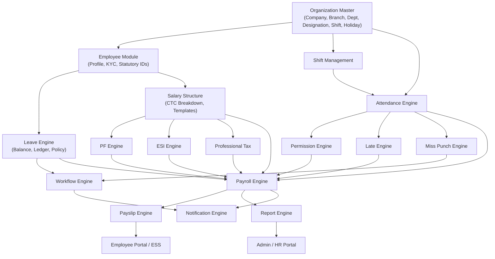

# Complete Enterprise HRMS Business Module Audit

> **Methodology**: Every feature below is rated against what a production HRMS (Keka, GreytHR, Zoho People, Darwinbox) ships out-of-the-box. Ratings reflect **business capability delivered to the end user**, not code quality or architecture elegance.

---

## ORGANIZATION MODULE

| Feature | Status | Score | Notes |
|---------|--------|-------|-------|
| Company | CRUD exists. No logo, address, registration, GST, TAN, PAN fields. | 3/10 | Only `name` and `code`. Enterprise needs full legal entity details. |
| Branch | CRUD exists. Has `companyId`, `name`, `code`, `location`. | 4/10 | Missing address, phone, ESSL device mapping per branch, timezone per branch. |
| Department | CRUD exists. Linked to `companyId`. | 4/10 | Missing department head, cost center, budget. |
| Designation | CRUD exists. Linked to `companyId`, optional `departmentId`. | 4/10 | Missing grade, band, pay scale mapping. |
| Role | Only `Admin` and `Employee` as string literals. | 1/10 | No dynamic roles. No HR, Payroll Admin, Manager, HOD, Accounts roles. No permission matrix. |
| Permission Matrix (RBAC) | `require_roles("Admin")` only. | 1/10 | No feature-level permissions. No module access control. No page-level guards beyond Admin/Employee split. |
| Employee Hierarchy | `managerId` field on User document. | 3/10 | Single level only. No org chart. No dotted-line reporting. No matrix reporting. No team view. |
| Reporting Manager | Resolved via `managerId`. Used in workflow routing. | 4/10 | Works for single-level approval. No validation that managerId exists. No self-referencing check. |
| Shift | **Completely hardcoded** in `AttendancePolicy` model (`shiftStartTime: "10:00:00"`). | 0/10 | No shift master. No shift assignment per employee. No weekly rotation. No night shift. No flexible shifts. |
| Holiday Calendar | Admin can add holidays (`name`, `date`, `type`). Attendance engine checks `db.holidays` when filling absent days. | 3/10 | No yearly calendar management. No branch-specific holidays. No optional/restricted holiday support. No recurring holiday templates. |
| Financial Year | Not implemented. | 0/10 | No FY configuration. No FY-based leave reset, payroll period, or tax computation. |
| Cost Center | Not implemented. | 0/10 | |
| Business Unit | Not implemented. | 0/10 | |
| Grade / Band | Not implemented. | 0/10 | No pay grade system. |
| Employment Type | Field exists (`empType`) as free-text during creation. | 1/10 | Not a master. No differentiation in policies (permanent vs contract vs intern). |
| Location | Branch has optional `location` string. | 1/10 | No geo-coordinates. No address model. |
| Geo Fencing | Not implemented. | 0/10 | |
| Organization Policies | `AttendancePolicy` stored in `settings` collection. | 2/10 | Only attendance policy. No leave policy, permission policy, payroll policy, approval policy as configurable entities. |
| Document Types | Not implemented. | 0/10 | No configurable document type master (Offer Letter, Experience Letter, ID Proof, etc.). |

**Module Score: 2/10** | **Completion: 15%**

> **Enterprise Gap**: Keka/GreytHR ship with full legal entity management, multi-branch holiday calendars, shift rosters, grade/band structures, dynamic RBAC with feature-level permissions, and org chart visualizations. This module currently only has skeleton CRUD.

---

## EMPLOYEE MODULE

| Feature | Status | Score | Notes |
|---------|--------|-------|-------|
| Employee Profile | `empId`, `name`, `role`, `phone`, `address`, `email`. | 3/10 | Missing DOB, gender, blood group, marital status, nationality, photo. |
| Personal Details | Phone and address only. | 2/10 | No permanent/current address separation. No personal email vs work email. |
| Employment Details | `empType`, `joiningDate`, `designation`, `department`, `branch` as flat fields. | 3/10 | No confirmation date, notice period, probation period, contract end date, work location. |
| Joining | User provisioned via `create_provisioned_user`. Basic onboarding. | 2/10 | No joining workflow, no offer letter, no document collection checklist, no induction tracking. |
| Confirmation | Not implemented. | 0/10 | No probation tracking, no confirmation workflow, no auto-reminders. |
| Probation | Not implemented. | 0/10 | |
| Resignation | Not implemented. | 0/10 | No resignation request, no notice period tracking, no exit interview, no clearance workflow. |
| Termination | `isActive` toggle only. | 1/10 | No termination reason, no F&F (Full & Final Settlement), no last working day. |
| Promotion | Not implemented. | 0/10 | No promotion history, no effective date, no salary revision link. |
| Transfer | Not implemented. | 0/10 | No inter-branch/department transfer workflow. |
| Bank Details | `bankName`, `accountNumber`, `ifscCode` as nested object. | 3/10 | No bank verification, no cancelled cheque upload, no multi-bank support. |
| PAN | Not stored. | 0/10 | |
| Aadhaar | Not stored. | 0/10 | |
| ESI Number / IP Number | Not stored. | 0/10 | |
| PF Number / UAN | Not stored. | 0/10 | |
| Nominee | Not implemented. | 0/10 | |
| Emergency Contact | Not implemented. | 0/10 | |
| Family Details | Not implemented. | 0/10 | |
| Education | Not implemented. | 0/10 | |
| Experience (Previous) | Not implemented. | 0/10 | |
| Documents | Not implemented. | 0/10 | No file upload, no document vault. |
| Employee Timeline | Not implemented. | 0/10 | No chronological history of promotions, transfers, salary revisions. |

**Module Score: 1.5/10** | **Completion: 10%**

> **Enterprise Gap**: Every production HRMS stores 50+ fields per employee including statutory IDs (PAN, Aadhaar, UAN, ESI IP), family details, nominees, education, experience, documents, and maintains a complete lifecycle timeline. This module stores approximately 8 fields.

---

## ATTENDANCE MODULE

| Feature | Status | Score | Notes |
|---------|--------|-------|-------|
| Raw ESSL Logs | Ingested via SOAP, deduplicated by `fingerprint` hash. Stored in `attendance_logs`. | 8/10 | Robust. Handles multiple payload formats. Proper fingerprinting prevents duplicates. |
| Attendance Processing | `build_daily_summaries` groups logs by empId+date, runs through PolicyEngine. | 8/10 | Correctly identifies first-in/last-out. Timezone-aware (IST). |
| Attendance Summary | Daily records with `inTime`, `outTime`, `workHours`, `status`, `lateMinutes`, `lateCount`, `permissionHoursUsed`, `lopHours`, `halfDayCount`. | 7/10 | Good field coverage. Missing overtime hours. |
| Attendance Rebuild | Triggered on Miss Punch approval. Fetches day's logs and re-runs `build_daily_summaries`. | 7/10 | Works correctly. Could handle batch rebuilds for date ranges. |
| Grace Period | 3-minute configurable grace. Arrivals within grace = Present, no late. | 9/10 | Correctly implemented. |
| Late Tracking | Minutes 4–15 = Late. Count tracked monthly. Thresholds trigger half-day/full-day LOP. | 8/10 | Implemented with monthly aggregation and cumulative tracking. |
| Half Day | After 10:30 AM (configurable `halfDayCutoffTime`) = Half Day status. | 7/10 | Works but doesn't distinguish between first-half and second-half. |
| LOP | Generated from late thresholds and permission excess. | 6/10 | Logic exists but is coupled between policy engine and attendance service with some TODO comments. |
| Week Off | Sunday is hardcoded as weekoff (`weekday() == 6`). | 2/10 | No configurable weekoff patterns. No alternate Saturday. No employee-specific weekoff. |
| Holiday | Checked against `db.holidays` collection during date fill. | 4/10 | Basic. No branch-specific holidays. No optional holidays. |
| Multiple Shifts | Not implemented. | 0/10 | Single hardcoded shift only. |
| Night Shift | Not implemented. | 0/10 | Cross-midnight punch grouping not handled. |
| Rotational Shift | Not implemented. | 0/10 | |
| Shift Assignment | Not implemented. | 0/10 | No per-employee or per-department shift assignment. |
| Roster | Not implemented. | 0/10 | |
| Comp Off | Not implemented. | 0/10 | No comp-off generation for working on holidays/weekoffs. |
| Attendance Correction (Manual) | Only via Miss Punch workflow. | 3/10 | No direct admin correction/override UI for arbitrary edits. |
| Manual Attendance | Not implemented. | 0/10 | No manual mark as present/absent/half-day by admin. |
| Geo Attendance | Not implemented. | 0/10 | |
| Mobile Attendance | Not implemented. | 0/10 | |
| Biometric Device Sync | ESSL SOAP integration working. Single device. | 6/10 | Only one serial number configured globally. No multi-device, multi-branch support. |

**Module Score: 5/10** | **Completion: 40%**

> **Enterprise Gap**: The core punch-to-status pipeline is genuinely strong. The massive gaps are in shift management (the entire shift subsystem is missing), weekoff configurability, multi-device support, and mobile/geo attendance. GreytHR and Keka allow unlimited shifts, weekly rosters, auto-rotation, and comp-off generation.

---

## MISS PUNCH ENGINE

| Feature | Status | Score | Notes |
|---------|--------|-------|-------|
| Request Submission | Employee creates request with date, type (IN/OUT), time, reason. | 8/10 | Validates no duplicate pending requests. Finds manager automatically. |
| Workflow Routing | Routes to `managerId`. Creates generic `Workflow` entity. | 7/10 | Single-level only. |
| Approval / Rejection | Manager approves/rejects with optional remarks. `WorkflowAction` recorded. | 8/10 | Clean state machine. |
| Attendance Rebuild | On approval: synthetic log injected → `build_daily_summaries` re-runs → attendance updated. | 9/10 | Excellent. Correctly rebuilds without duplicating entries (fingerprint-based). |
| Audit Trail | Old/new attendance snapshots stored in `attendance_audit_logs`. | 7/10 | Data captured but no UI to view audit logs. |
| Notification | Not implemented. | 0/10 | No email/push to employee on approval/rejection. No push to manager on new request. |
| History View | Employee sees past requests with workflow status via `$lookup` aggregation. | 7/10 | |
| Reports | Not implemented. | 0/10 | No miss-punch analytics. |

**Module Score: 6/10** | **Completion: 60%**

---

## PERMISSION ENGINE

| Feature | Status | Score | Notes |
|---------|--------|-------|-------|
| Monthly Permission Hours | Configured in `AttendancePolicy.monthlyPermissionHours` (default 1.0 hour). | 4/10 | Tracked during late processing. No standalone permission request workflow. |
| Late Permission Window | Minutes 16–30 consume permission hours automatically during attendance processing. | 5/10 | Automatically calculated. |
| Permission Approval | Not implemented. | 0/10 | No explicit permission request/approval workflow. Permissions are auto-deducted. |
| Permission Ledger | Monthly aggregation tracked in `PolicyEngine._add_permission()` in-memory cache. | 2/10 | Not persisted as a ledger. Recalculated on each attendance run. |
| Permission Balance | Shown as alert on dashboard (`Remaining Permission Balance: X Minutes`). | 3/10 | Alert exists. No dedicated balance view. |
| Permission Stacking | Excess tracked as `permissionHoursExceeded`. | 3/10 | Raw excess tracked but no month-end carryover or LOP conversion batch. |
| LOP Conversion | Excess permission → `lopHours` added directly in policy engine. | 3/10 | Inline calculation. No configurable conversion rules. |
| Reports | Not implemented. | 0/10 | |
| Settings | Part of `AttendancePolicy` model. | 3/10 | No standalone permission policy. |

**Module Score: 2.5/10** | **Completion: 25%**

> **Enterprise Gap**: Keka/Zoho People have standalone permission modules with request/approval workflows, monthly balances, carryover rules, and comprehensive reports. This system auto-deducts permissions during late processing with no employee control or visibility.

---

## LATE ENGINE

| Feature | Status | Score | Notes |
|---------|--------|-------|-------|
| Grace Period | Configurable `graceMinutes: 3`. | 9/10 | Properly implemented. |
| Late Count | Monthly count tracked in `PolicyEngine.monthly_late_counts`. | 7/10 | In-memory cache, recalculated from DB on each attendance run. |
| Late Thresholds | `lateHalfDayThreshold: 4`, `lateFullDayThreshold: 6`, `lateIncrementThreshold: 4`. | 7/10 | Configurable but not exposed in admin settings UI. |
| Half Day Conversion | 4 lates = 0.5 day deduction. 6 lates = 1.0 day. | 7/10 | Logic works. Some confusing inline comments (`1.0 - 0.5 # Since 0.5 was already deducted`). |
| Automatic Leave Conversion | Not implemented. | 0/10 | Lates convert to LOP only. No option to deduct CL/EL instead. |
| Admin Configurability | Thresholds exist in `AttendancePolicy` model. UI exists in `AdminAttendancePolicy.tsx`. | 5/10 | Basic settings page exists. No per-department or per-designation overrides. |
| Reports | Not implemented. | 0/10 | No late report by employee/department/month. |

**Module Score: 5/10** | **Completion: 50%**

---

## LEAVE ENGINE

| Feature | Status | Score | Notes |
|---------|--------|-------|-------|
| CL / SL / EL Types | `leaveType` stored as free-text from dropdown (annual, sick, casual, earned, compoff). | 2/10 | No leave type master. No configurable rules per type. |
| Leave Request | Employee submits with fromDate, toDate, reason. Stored in `leave_requests`. | 3/10 | Basic insert. No date overlap validation. No balance check before submission. |
| Leave Approval | Admin approves/rejects. On approval, creates `source: "override"` attendance records. | 3/10 | Bypasses workflow engine entirely. Direct Admin-only approval. No manager routing. |
| Leave Balance | `leave_balances` collection queried but never populated. | 1/10 | No balance ledger. No credit/debit system. Dashboard shows `leaveBalance: 0` hardcoded. |
| Carry Forward | Not implemented. | 0/10 | |
| Yearly Allocation | Not implemented. | 0/10 | No cron/batch to credit annual leave entitlements. |
| LOP | Not implemented as a leave type with ledger tracking. | 0/10 | LOP exists only in attendance engine, not leave engine. |
| Maternity / Paternity | Not implemented. | 0/10 | |
| Comp Off | Not implemented. | 0/10 | |
| Encashment | Not implemented. | 0/10 | |
| Expiry | Not implemented. | 0/10 | |
| Sandwich Leave Rule | Not implemented. | 0/10 | |
| Holiday Between Leave | Not implemented. | 0/10 | |
| Half Day Leave | Not implemented. | 0/10 | |
| Hourly Leave | Not implemented. | 0/10 | |
| Leave Calendar | Not implemented. | 0/10 | No team calendar showing who is on leave. |
| Leave Policy | Not implemented. | 0/10 | No configurable policy (max consecutive days, minimum notice, etc.). |
| Leave Reports | Not implemented. | 0/10 | |

**Module Score: 1/10** | **Completion: 10%**

> **Enterprise Gap**: Leave management is arguably the most complex module in any HRMS. GreytHR has 30+ configurable parameters per leave type (eligibility, accrual frequency, carry forward limit, encashment rules, sandwich rules, gender restrictions, probation exclusions). This system has a raw insert with no business rules.

---

## OD ENGINE

| Feature | Status | Score | Notes |
|---------|--------|-------|-------|
| OD Request | UI form exists. Stored as `leave_requests` with `requestType: "od"`. | 2/10 | No dedicated OD model. Shares schema with leave requests. |
| Approval | Goes through same Admin leave approval flow. | 2/10 | No manager routing. |
| Attendance Integration | On approval, creates `source: "override"` with `status: "od"`. | 3/10 | Basic override. No OD-specific work hours or location tracking. |
| ESSL Validation | Not implemented. | 0/10 | No validation that employee was actually absent from biometric. |

**Module Score: 1.5/10** | **Completion: 15%**

---

## WORKFLOW ENGINE

| Feature | Status | Score | Notes |
|---------|--------|-------|-------|
| Generic Workflow | `Workflow` model with `workflowType`, `entityId`, `employeeId`, `currentApproverId`, `status`. | 7/10 | Clean generic design. Used for Miss Punch. Hook pattern for dispatch. |
| Workflow Actions | `WorkflowAction` records every approve/reject with timestamp and remarks. | 7/10 | Good audit trail. |
| Single-Level Approval | Routes to `managerId`. Works for Miss Punch. | 7/10 | |
| Multi-Level Approval | Not implemented. | 0/10 | No Level 1 → Level 2 → Level 3 routing. |
| Dynamic Routing | Not implemented. | 0/10 | No conditional routing based on amount, leave type, department. |
| Conditional Routing | Not implemented. | 0/10 | |
| Parallel Approval | Not implemented. | 0/10 | |
| Delegation | Not implemented. | 0/10 | No out-of-office delegation. |
| Escalation | Not implemented. | 0/10 | No auto-escalation after SLA breach. |
| Reminder | Not implemented. | 0/10 | |
| SLA | Not implemented. | 0/10 | No time-bound approval requirements. |
| Workflow Designer | Not implemented. | 0/10 | No visual builder. No configurable stages. |
| Workflow Audit UI | Not implemented. | 0/10 | Data exists in DB but no UI to view workflow action history. |

**Module Score: 3/10** | **Completion: 20%**

> **Enterprise Gap**: Darwinbox and SAP SuccessFactors ship with visual workflow designers, multi-level conditional routing, parallel approvals, delegation, escalation chains, and SLA monitoring. This engine handles single-level linear routing only.

---

## SALARY STRUCTURE MODULE

| Feature | Status | Score | Notes |
|---------|--------|-------|-------|
| Salary Structure | Not implemented. | 0/10 | No CTC, Basic, HRA, DA, Special Allowance breakdown. |
| Salary Revisions | Not implemented. | 0/10 | No revision history with effective dates. |
| Salary Components | Not implemented. | 0/10 | No configurable earnings/deductions master. |
| Salary Template | Not implemented. | 0/10 | No company-wide or designation-wise templates. |
| Allowance Template | Not implemented. | 0/10 | |
| Effective Dates | Not implemented. | 0/10 | |

**Module Score: 0/10** | **Completion: 0%**

---

## PF ENGINE

| Feature | Status | Score | Notes |
|---------|--------|-------|-------|
| PF Gross Calculation | Not implemented. | 0/10 | |
| PF Ceiling (₹15,000) | Not implemented. | 0/10 | |
| Actual PF (12%) | Not implemented. | 0/10 | |
| Higher PF Opt-in | Not implemented. | 0/10 | |
| Employer Pension (8.33%) | Not implemented. | 0/10 | |
| Existing Pension Member | Not implemented. | 0/10 | |
| Fresh Employee Rules | Not implemented. | 0/10 | |
| Processing Fee (Admin Charge) | Not implemented. | 0/10 | |
| Settings / Versioning | Not implemented. | 0/10 | |
| UAN Management | Not stored. | 0/10 | |
| PF Reports / Challan | Not implemented. | 0/10 | |

**Module Score: 0/10** | **Completion: 0%**

---

## ESI ENGINE

| Feature | Status | Score | Notes |
|---------|--------|-------|-------|
| Threshold (₹21,000 gross) | Not implemented. | 0/10 | |
| Employee Contribution (0.75%) | Not implemented. | 0/10 | |
| Employer Contribution (3.25%) | Not implemented. | 0/10 | |
| Eligibility Check | Not implemented. | 0/10 | |
| IP Number | Not stored. | 0/10 | |
| ESI Reports | Not implemented. | 0/10 | |

**Module Score: 0/10** | **Completion: 0%**

---

## PROFESSIONAL TAX ENGINE

**Not implemented. 0/10. 0% complete.**

No state-wise slab configuration. No monthly deduction calculation. No payroll integration.

---

## SALARY ADVANCE ENGINE

**Not implemented. 0/10. 0% complete.**

No advance request, approval, recovery schedule, or payroll integration.

---

## OTHER ADVANCE / LOAN ENGINE

**Not implemented. 0/10. 0% complete.**

---

## REIMBURSEMENT ENGINE

**Not implemented. 0/10. 0% complete.**

No trip sheet, no per-km rules, no receipt upload, no approval, no accounts verification, no payroll posting.

---

## CASH VOUCHER ENGINE

**Not implemented. 0/10. 0% complete.**

No bill upload, no OCR, no approval chain, no accounts verification.

---

## PAYROLL ENGINE

| Feature | Status | Score | Notes |
|---------|--------|-------|-------|
| Payroll Generation | Not implemented. | 0/10 | |
| Monthly Snapshot | Not implemented. | 0/10 | |
| Salary Calculation | Not implemented. | 0/10 | |
| Attendance Integration | Attendance data exists but no payroll consumes it. | 0/10 | |
| Leave Integration | Not implemented. | 0/10 | |
| PF/ESI/PTax Integration | Not implemented. | 0/10 | |
| Salary Advance Recovery | Not implemented. | 0/10 | |
| Payroll Lock/Freeze | Not implemented. | 0/10 | |
| Payroll Reversal | Not implemented. | 0/10 | |
| Payroll History | Not implemented. | 0/10 | |
| Payroll Reports | Not implemented. | 0/10 | |

**Module Score: 0/10** | **Completion: 0%**

---

## PAYSLIP ENGINE

| Feature | Status | Score | Notes |
|---------|--------|-------|-------|
| Payslip View | API endpoint exists (`GET /payslip/me`). Queries `payslips` collection. | 1/10 | Endpoint exists but collection is always empty. No payslip generation logic. |
| PDF Generation | Not implemented. | 0/10 | |
| Payslip History | Frontend UI exists (beautiful Payslip page). | 1/10 | UI is built but shows no data because no payslip generation exists. |
| Monthly Snapshots | Not implemented. | 0/10 | |
| Employee Portal Download | Not implemented. | 0/10 | |

**Module Score: 0.5/10** | **Completion: 5%**

---

## REPORT ENGINE

**Not implemented. 0/10. 0% complete.**

No attendance report, leave report, salary report, PF/ESI sheets, deduction summaries, branch summaries, or export functionality (Excel/CSV/PDF).

---

## NOTIFICATION ENGINE

**Not implemented. 0/10. 0% complete.**

No email integration. No in-app notifications. No workflow notifications. No reminders. No approval push.

---

## SETTINGS MODULE

| Feature | Status | Score | Notes |
|---------|--------|-------|-------|
| Attendance Policy Settings | Stored in `settings` collection. Admin UI exists (`AdminAttendancePolicy.tsx`). | 5/10 | Functional. All 15 policy fields editable. |
| Shift Settings | Not implemented. | 0/10 | |
| Leave Policy Settings | Not implemented. | 0/10 | |
| Permission Policy Settings | Part of attendance policy. No standalone UI. | 1/10 | |
| Holiday Settings | Admin can add holidays via `AdminHolidays.tsx`. | 3/10 | Basic add only. No edit/delete. No recurring. No branch-specific. |
| Payroll Settings | Not implemented. | 0/10 | |
| PF Settings | Not implemented. | 0/10 | |
| ESI Settings | Not implemented. | 0/10 | |
| Company Settings | Not implemented. | 0/10 | |
| Financial Year Config | Not implemented. | 0/10 | |
| Approval Settings | Not implemented. | 0/10 | |

**Module Score: 1/10** | **Completion: 10%**

---

## DASHBOARDS

| Feature | Status | Score | Notes |
|---------|--------|-------|-------|
| Employee Dashboard | Shows attendance stats, distribution chart, monthly trend, smart alerts (late/permission/LOP warnings). | 6/10 | Good alert system. Missing leave balance, upcoming holidays, recent payslip. |
| Manager Dashboard | Not implemented as a separate role. | 0/10 | No team attendance view. No pending approvals widget on dashboard (only separate page). |
| HR Dashboard | Not implemented. | 0/10 | |
| Admin Dashboard | Shows total/active employees, attendance rate, branch data, recent employees. | 4/10 | Functional but basic. Attendance trend chart works. Missing payroll, leave, attrition KPIs. |
| Payroll Dashboard | Not implemented. | 0/10 | |
| Analytics / KPIs | Basic attendance rate calculation. | 2/10 | No configurable KPIs. No drill-down. No comparative analytics. |

**Module Score: 2/10** | **Completion: 15%**

---

## FINAL SCORES

| Module | Current Score | Enterprise Score Needed | Completion % | Priority | Complexity |
|--------|--------------|------------------------|-------------|----------|------------|
| Organization | 2/10 | 8/10 | 15% | High | Medium |
| Employee | 1.5/10 | 9/10 | 10% | High | Medium |
| Attendance | 5/10 | 9/10 | 40% | High | High |
| Miss Punch | 6/10 | 8/10 | 60% | Medium | Low |
| Permission | 2.5/10 | 7/10 | 25% | Medium | Medium |
| Late Engine | 5/10 | 8/10 | 50% | Medium | Low |
| Leave | 1/10 | 9/10 | 10% | **Critical** | High |
| OD | 1.5/10 | 7/10 | 15% | Medium | Low |
| Workflow | 3/10 | 8/10 | 20% | High | High |
| Salary Structure | 0/10 | 9/10 | 0% | **Critical** | High |
| PF Engine | 0/10 | 9/10 | 0% | **Critical** | High |
| ESI Engine | 0/10 | 8/10 | 0% | **Critical** | Medium |
| Professional Tax | 0/10 | 7/10 | 0% | High | Low |
| Salary Advance | 0/10 | 7/10 | 0% | Medium | Medium |
| Reimbursement | 0/10 | 7/10 | 0% | Low | Medium |
| Cash Voucher | 0/10 | 6/10 | 0% | Low | Medium |
| Payroll | 0/10 | 10/10 | 0% | **Critical** | Very High |
| Payslip | 0.5/10 | 8/10 | 5% | High | Medium |
| Reports | 0/10 | 9/10 | 0% | High | High |
| Notifications | 0/10 | 7/10 | 0% | Medium | Medium |
| Settings | 1/10 | 8/10 | 10% | High | Medium |
| Dashboards | 2/10 | 8/10 | 15% | Medium | Medium |

---

## DEPENDENCY GRAPH

**Critical Path**: Organization → Employee → Salary Structure → PF/ESI → Payroll → Payslip → Reports

Nothing in the Payroll chain can begin until Salary Structure exists. Salary Structure requires a complete Employee module with statutory IDs. Payroll requires completed Leave, Attendance, PF, ESI, and PTax engines.

---

## MATURITY ASSESSMENT

| Dimension | Current Level | Score |
|-----------|--------------|-------|
| **HRMS Maturity** (Core HR, Org, Employee lifecycle) | Prototype | 12% |
| **ESS Maturity** (Self-service, Leave, Attendance, Profile) | Early MVP | 30% |
| **Payroll Maturity** (Salary, Statutory, Deductions, Payslip) | Not Started | 0% |
| **Workflow Maturity** (Approvals, Routing, Automation) | Basic single-level | 20% |

### Overall Enterprise Readiness: **~15%**

> This is assessed purely on **business capabilities delivered**. The project has strong attendance punch processing, but an enterprise HRMS is measured by its payroll accuracy, statutory compliance, leave management depth, and workflow sophistication. Those areas are at 0%.

### Comparison Against Production HRMS

| Module | Keka | GreytHR | Zoho People | This Project |
|--------|------|---------|-------------|--------------|
| Organization | ★★★★★ | ★★★★☆ | ★★★★★ | ★☆☆☆☆ |
| Employee | ★★★★★ | ★★★★★ | ★★★★★ | ★☆☆☆☆ |
| Attendance | ★★★★★ | ★★★★★ | ★★★★☆ | ★★★☆☆ |
| Leave | ★★★★★ | ★★★★★ | ★★★★★ | ★☆☆☆☆ |
| Payroll | ★★★★★ | ★★★★★ | ★★★★☆ | ☆☆☆☆☆ |
| PF/ESI/Statutory | ★★★★★ | ★★★★★ | ★★★★☆ | ☆☆☆☆☆ |
| Workflow | ★★★★☆ | ★★★★☆ | ★★★★★ | ★★☆☆☆ |
| Reports | ★★★★★ | ★★★★★ | ★★★★★ | ☆☆☆☆☆ |
| Notifications | ★★★★☆ | ★★★★☆ | ★★★★★ | ☆☆☆☆☆ |

### Estimated Remaining Development

| Category | Estimated Effort |
|----------|-----------------|
| Organization + Employee + Settings | 3–4 weeks |
| Leave Engine (full ledger, policies, rules) | 3–4 weeks |
| Shift Management + Attendance gaps | 2–3 weeks |
| Salary Structure + Templates | 2–3 weeks |
| PF + ESI + PTax Engines | 2–3 weeks |
| Payroll Generation + Payslip | 4–6 weeks |
| Workflow (multi-level, escalation) | 2–3 weeks |
| Reports + Exports | 3–4 weeks |
| Notifications | 1–2 weeks |
| Dashboards (Manager/HR/Payroll) | 2 weeks |
| **Total Estimated** | **~24–32 weeks** |

### Current Maturity Stage

**Stage 1.5 – Advanced Prototype**

The project has proven its architectural viability with a working attendance pipeline and a generic workflow hook system. However, from a pure business capability perspective, it cannot function as an HRMS without a leave ledger, salary structures, or statutory compliance engines. It is midway between Prototype and Functional MVP.
